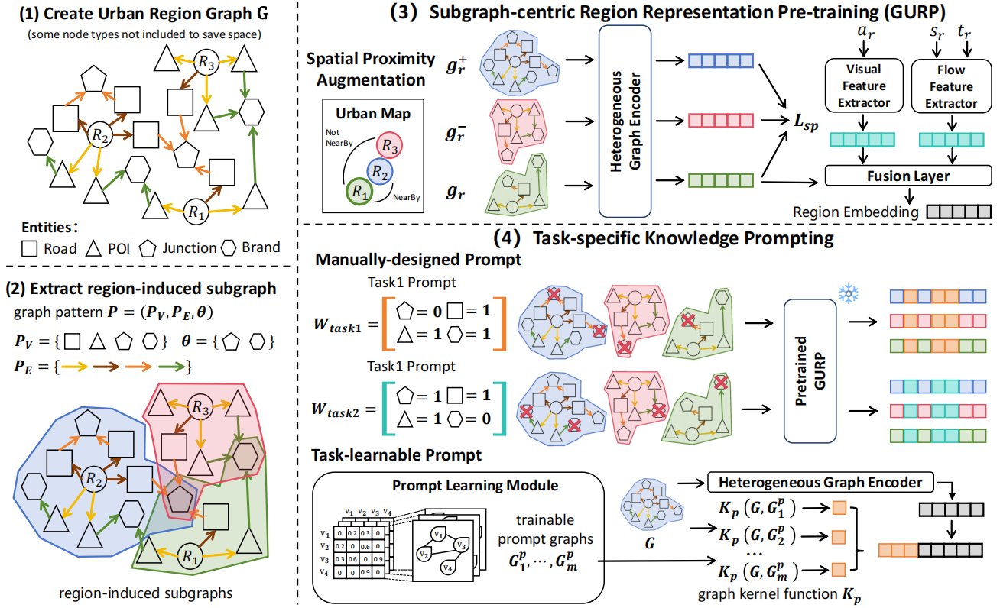

# GURPP

Overview
----------------------------------
Official code for: **Urban Region Embedding Pre-training and Prompting: A Graph-based Approach**

[//]: # (More details to come after accepted.)

## Framework

## Set up
1.